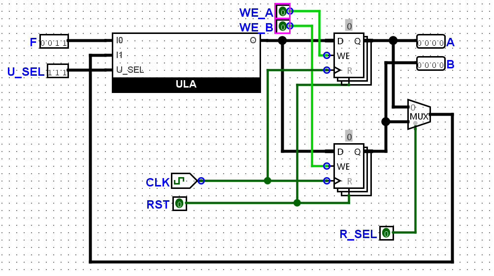
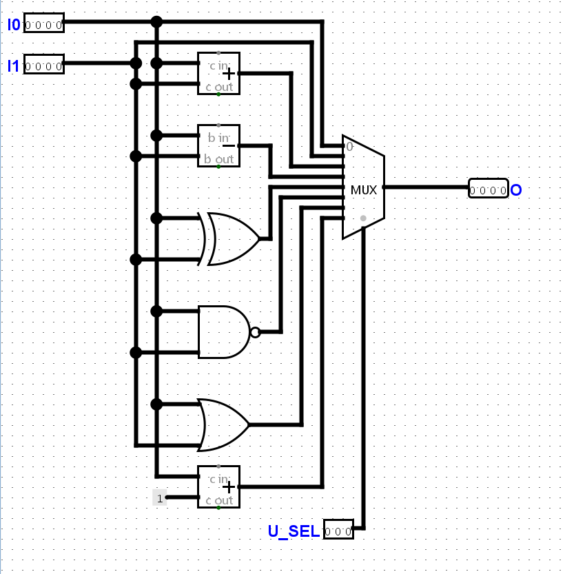

# Atividade Guiada 1
## Objetivo
Acompanhar o professor no desenvolvimento de um projeto completo conforme as figuras a seguir. Nesta aula os alunos observarão a utilização de componentes para a realização de simulações e hierarquia de projetos. O circuito em questão é uma parte do núcleo de um processador simples de 4 bits, composto por dois registradores de propósito geral, um multiplexador e uma unidade lógica e aritmética (ALU). O circuito é responsável por realizar operações de soma e subtração entre os valores armazenados nos registradores.

## Figuras
### Esquema do Circuito

### Unidade Lógica e Aritmética (ALU)
