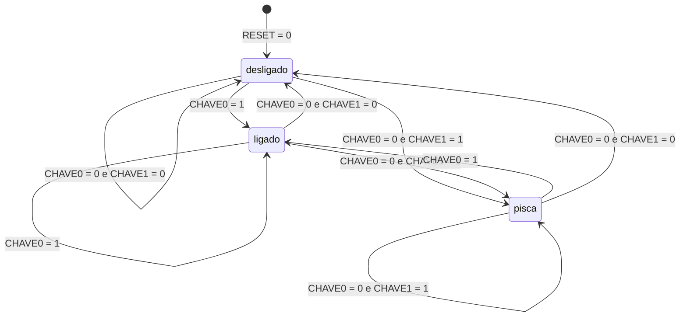
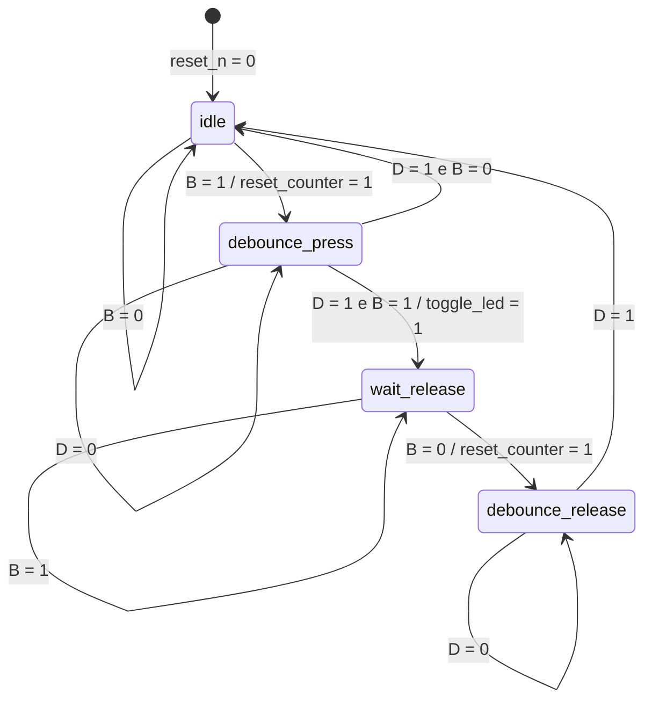

# Diagramas de transicao de estados - Aula 010

## a010b_maquina_estados.vhd

Entradas:

- `RESET = 0`: retorna para `desligado`.
- `CHAVE0`: seleciona o estado `ligado`.
- `CHAVE1`: seleciona o estado `pisca`.

Saida:

- `desligado`: `LED = 0`
- `ligado`: `LED = 1`
- `pisca`: `LED = pisca_signal`

Observacao: quando `CHAVE0 = 1` e `CHAVE1 = 1`, a maquina vai para `ligado`, pois `CHAVE0` tem prioridade na logica de transicao.

## a010c_toggle.vhd

Sinais usados no diagrama:

- `B = current_button = not KEY(0)`: botao pressionado.
- `D = debounce_done`: tempo de debounce concluido.
- `reset_n = KEY(1)`: reset ativo em nivel baixo.

Saidas principais:

- `LEDR(0) = led_state`
- `toggle_led = 1` somente na transicao de `debounce_press` para `wait_release`, invertendo `led_state`.

Observacao: a maquina alterna o LED apenas uma vez por pressionamento valido do botao. Depois do toggle, ela espera a soltura e confirma o debounce da soltura antes de aceitar um novo clique.
