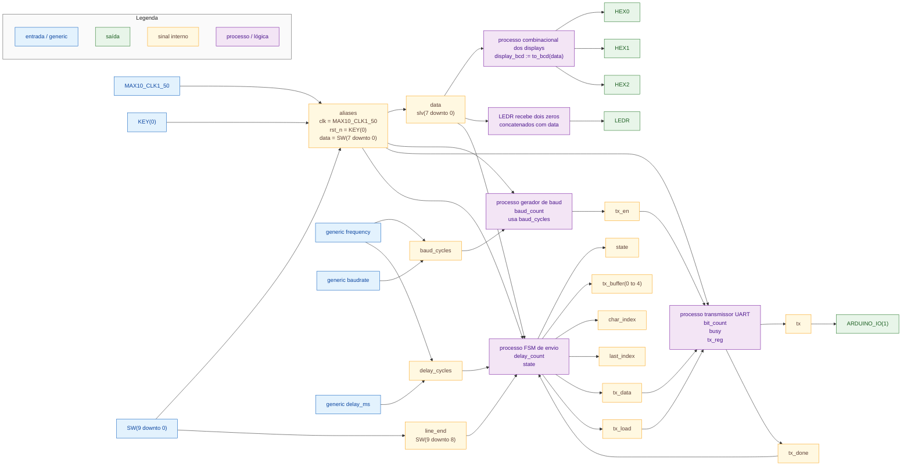
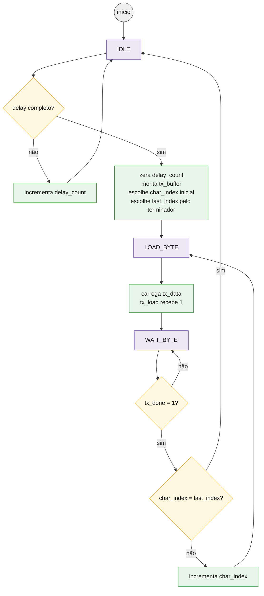

# Diagramas do exemplo `uart_sw`

Este arquivo mostra a relação entre os blocos concorrentes do código e a máquina de estados que controla o envio dos bytes pela UART.

## Conexões entre blocos

No diagrama, `slv` é abreviação de `std_logic_vector`.

## Papel de cada processo

| Bloco | Entradas principais | Saídas principais | Função |
| --- | --- | --- | --- |
| Processo dos displays | `data` | `HEX0`, `HEX1`, `HEX2` | Converte `SW(7 downto 0)` para BCD em uma variável local e mostra unidade, dezena e centena nos displays. |
| Gerador de baud | `clk`, `rst_n`, `baud_cycles` | `tx_en` | Gera um pulso de um ciclo na frequência de transmissão UART. |
| Transmissor UART | `clk`, `rst_n`, `tx_en`, `tx_load`, `tx_data` | `tx`, `tx_done` | Envia um byte no formato 8N1. A variável interna `busy` impede carregar novo byte durante uma transmissão. |
| FSM de envio | `clk`, `rst_n`, `data`, `SW(9 downto 8)`, `tx_done`, `delay_cycles` | `tx_buffer`, `char_index`, `last_index`, `tx_data`, `tx_load`, `state` | Aguarda o intervalo configurado, captura `data` como BCD em uma variável local, prepara os caracteres e envia um por vez. |

## Máquina de estados da FSM de envio

## Conteúdo do buffer de transmissão

Ao final do intervalo de espera, a FSM monta:

| Índice | Conteúdo |
| ---: | --- |
| `tx_buffer(0)` | ASCII da centena: `x"3" & captured_bcd(11 downto 8)` |
| `tx_buffer(1)` | ASCII da dezena: `x"3" & captured_bcd(7 downto 4)` |
| `tx_buffer(2)` | ASCII da unidade: `x"3" & captured_bcd(3 downto 0)` |
| `tx_buffer(3)` | primeiro terminador: `LF`, `CR` ou primeiro byte de `CRLF` |
| `tx_buffer(4)` | segundo terminador, usado apenas em `CRLF` |

O sinal `char_index` remove zeros à esquerda:

| Condição | Primeiro índice enviado |
| --- | ---: |
| centena diferente de zero | `0` |
| centena zero e dezena diferente de zero | `1` |
| centena zero e dezena zero | `2` |

Assim, `7` envia `"7\n"`, `42` envia `"42\n"` e `255` envia `"255\n"`.

O sinal `last_index` define onde a transmissão para:

| `SW(9 downto 8)` | Terminador | `last_index` |
| --- | --- | ---: |
| `00` | `LF` | `3` |
| `01` | `CR` | `3` |
| `10` | `CRLF` | `4` |
| `11` | nenhum | `2` |
